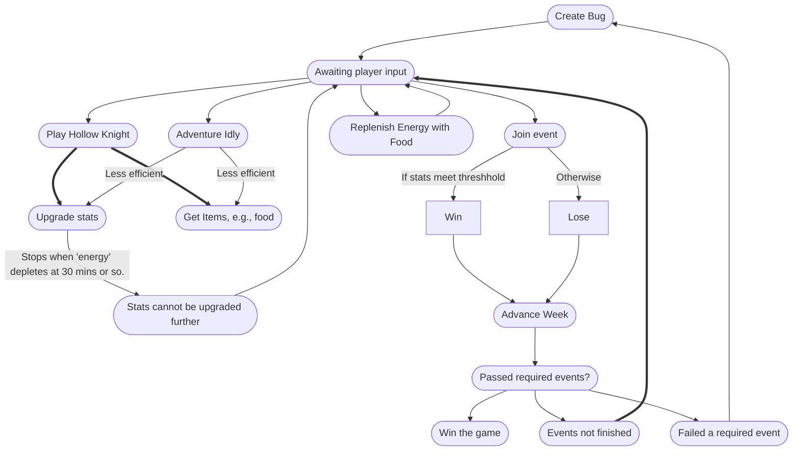

# Gameplay Loop

```mermaid
graph TD

CREATE(["Create Bug"]) --> INPUT

INPUT(["Awaiting player input"]) --> PLAY
INPUT --> IDLE
INPUT --> EVENT

PLAY(["Play Hollow Knight"]) ==> SKILL(["Upgrade stats"])
IDLE(["Adventure Idly"]) -->|Less efficient| SKILL

PLAY ==> ITEMS(["Get Items, e.g., food"])
IDLE -->|Less efficient| ITEMS

SKILL -->|Stops when 'energy' depletes at 30 mins or so.| MAX(["Stats cannot be upgraded further"])

MAX --> INPUT

EVENT(["Join event"]) -->|If stats meet threshhold| Win
EVENT -->|Otherwise| Lose

Win --> ADVANCE(["Advance Week"])
Lose --> ADVANCE

INPUT --> FEED(["Replenish Energy with Food"])
FEED --> INPUT


ADVANCE --> WEEK(["Passed required events?"])
WEEK --> SUCCESS(["Win the game"])
WEEK --> UNFINISHED(["Events not finished"]) ==> INPUT

WEEK --> FAILED(["Failed a required event"])
FAILED --> CREATE
```