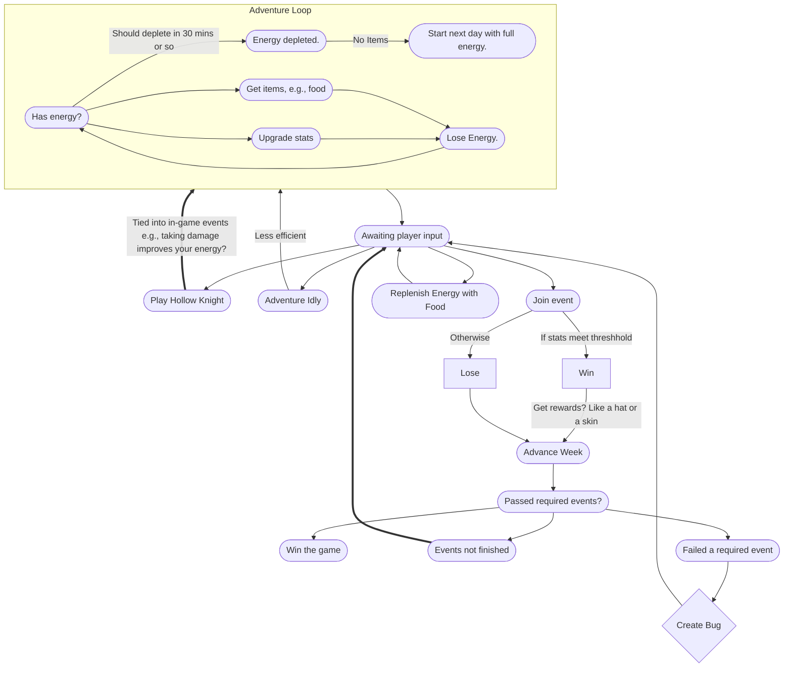

# Gameplay Loop

Note that there should be a way to stop leveling at a certain point to stop grinding for an event. Then you regain whatever that is after completing an event. I'm thinking a timer that's stored as a save that counts down every 30 minutes (so it finishes at the end of an un-interrupted run), up to 7 times. So that at the end of the week, the event becomes mandatory.

## Skills and Stats
- Energy
	- Max cannot be increased
	- Can be replenished with food
- Running
	- Run unless any of the below happens.
- Climbing
	- Climb whenever there's a collision to the right, unless on a skateboard
- Jumping
	- Determines arc of your jump over a gap. Determine if there's a jump with a trigger.
	- Lose if you fall in
	- Add soft barrier right before any jumps to set x-accel to zero (to force the bug to land before hitting the hole)
		- OR have the bug calculate where it will land (since this will be a fixed position based on jump skill), and decrease jump arc until a valid hit.
- Skateboarding
	- Skateboards will show up in front of half-pipes
	- Determines how fast the bug will go down the half-pipe (while hopping on the skateboard)
	- Like jumping, dismounting on the half-pipe will create a jump arc (?)
	- Trigger to auto-equip skateboard (regardless of y-pos)

## Items
- Each should offer three choices:
	1. Upgrade Skill 1 for Y amount
	2. Upgrade Skill 2 for Y amount
	3. Replenish X energy
